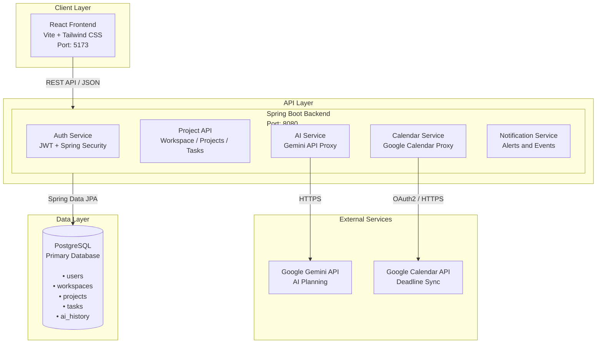
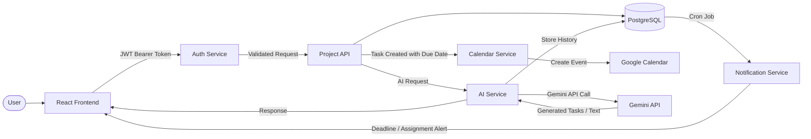
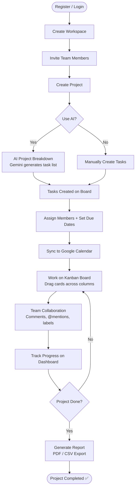
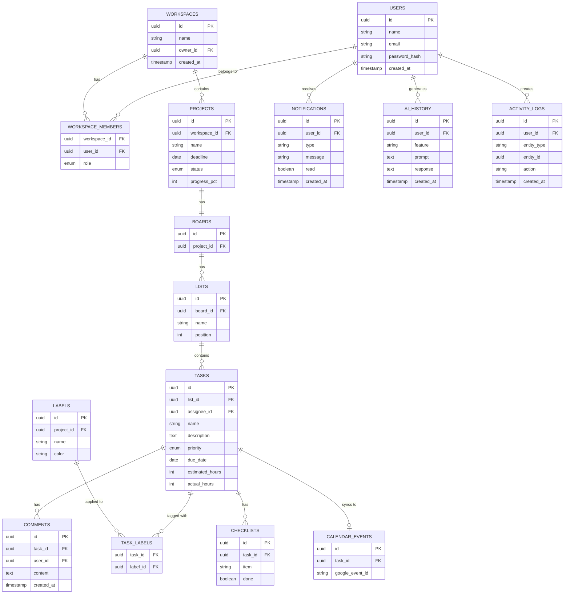
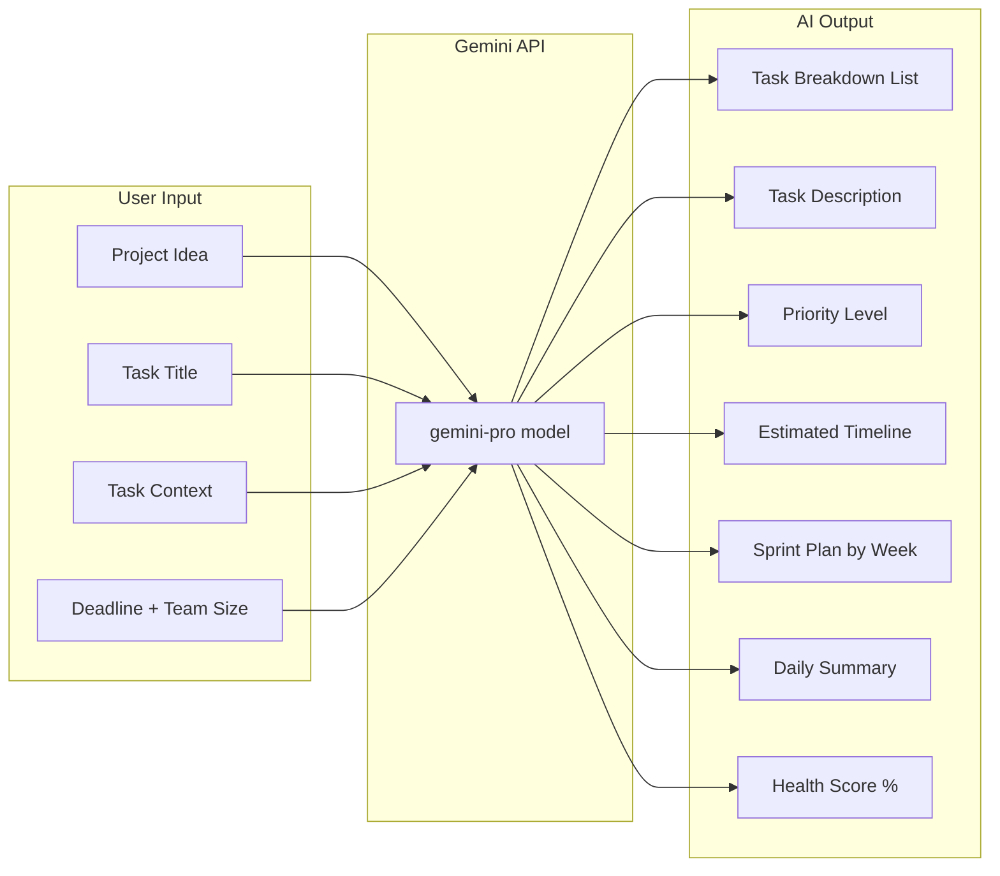
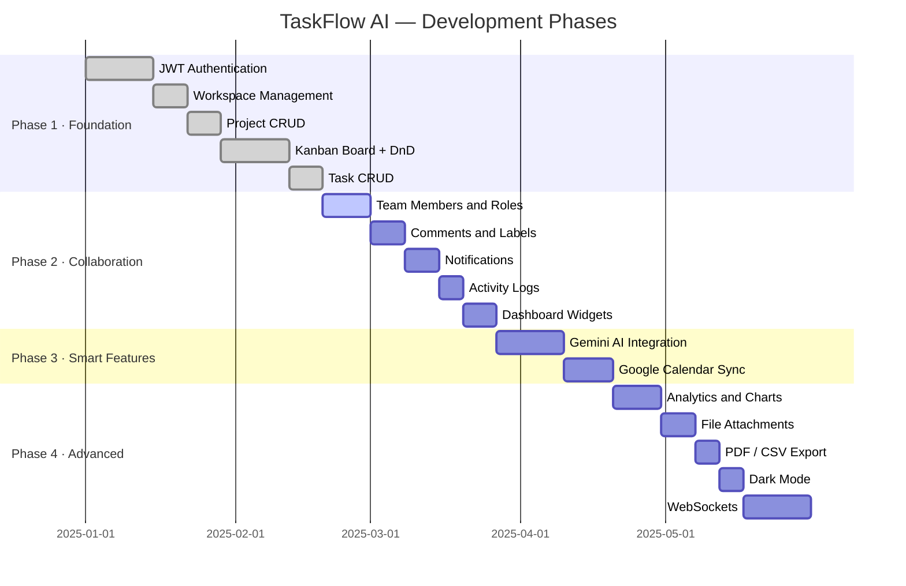

<div align="center">

# 🚀 TaskFlow AI

### Smart AI-Powered Project Management Platform

*A full-stack Kanban-style project management system powered by React, Spring Boot, PostgreSQL, and the Gemini AI API.*

[](https://www.oracle.com/java/)
[](https://spring.io/projects/spring-boot)
[](https://reactjs.org/)
[](https://www.postgresql.org/)
[](https://ai.google.dev/)
[](LICENSE)

[Features](#-features) • [Architecture](#-architecture) • [Getting Started](#-getting-started) • [API Reference](#-api-reference) • [Roadmap](#-roadmap)

</div>

> To view Mermaid diagrams in VS Code, install the [Markdown Preview Mermaid Support](https://marketplace.visualstudio.com/items?itemName=bierner.markdown-mermaid) extension, or view this file on GitHub.

---

## 📌 Project Overview

**TaskFlow AI** is a modern, collaborative project management platform that goes beyond simple task tracking. It combines the visual clarity of Kanban boards with the intelligence of Google's Gemini AI to help students, developers, and teams plan smarter, collaborate better, and ship faster.

> Think Trello, but with an AI project assistant built in.

---

## ✨ Features

### 🗂 Core Project Management
- **Workspaces** — Organize teams and projects under a shared workspace with role-based access
- **Kanban boards** — Drag-and-drop task cards across Backlog → To Do → In Progress → Testing → Completed
- **Task management** — Rich tasks with checklists, labels, attachments, comments, priority, and due dates
- **Team collaboration** — Assign members, @mention teammates, comment on tasks, view activity timelines

### 🤖 AI Features (Gemini API)

| Feature | Description |
|---|---|
| **Project breakdown** | Type a project idea — AI generates a full task list instantly |
| **Task descriptions** | Short title → AI writes a detailed, professional task description |
| **Priority suggestions** | AI evaluates task context and recommends a priority level |
| **Deadline estimation** | AI estimates completion time based on scope and team size |
| **Sprint planner** | AI splits your project into structured weekly sprints |
| **Daily summary** | AI summarizes completed work, upcoming deadlines, and at-risk items |
| **Health score** | AI rates overall project health and explains contributing factors |

### 📅 Google Calendar Integration
- Task due dates automatically create Google Calendar events
- Calendar events update or delete when tasks change
- View upcoming deadlines directly on the dashboard

### 📊 Dashboard & Analytics
- Project and task counts, productivity percentage, completion rate
- Bar, pie, and line charts for weekly and monthly progress
- Workload distribution across team members

### 🔔 Notifications
- Task assigned, deadline tomorrow, comment mention, AI plan ready

---

## 🏗 Architecture

### High-Level Architecture



---

### Data Flow



---

### User Workflow



---

### Database Schema



---

### AI Feature Flow



---

### Development Roadmap



---

## 🛠 Tech Stack

| Layer | Technology |
|---|---|
| Frontend | React 18, Vite, Tailwind CSS |
| Backend | Spring Boot 3, Spring MVC |
| Authentication | Spring Security + JWT |
| ORM | Spring Data JPA / Hibernate |
| Database | PostgreSQL 14+ |
| AI | Google Gemini API |
| Calendar | Google Calendar API |
| Charts | Recharts |
| Drag & Drop | @dnd-kit |
| Build Tool | Maven |

---

## 📁 Project Structure

```
taskflow-ai/
├── backend/                    # Spring Boot application
│   ├── src/main/java/
│   │   └── com/taskflow/
│   │       ├── auth/           # JWT auth, security config
│   │       ├── workspace/      # Workspace and members
│   │       ├── project/        # Project CRUD
│   │       ├── board/          # Kanban lists
│   │       ├── task/           # Task management
│   │       ├── ai/             # Gemini API integration
│   │       ├── calendar/       # Google Calendar sync
│   │       └── notification/   # Notification service
│   └── src/main/resources/
│       └── application.properties
│
├── frontend/                   # React application
│   ├── src/
│   │   ├── components/         # Reusable UI components
│   │   ├── pages/              # Route-level page components
│   │   ├── services/           # Axios API service files
│   │   ├── hooks/              # Custom React hooks
│   │   └── types/              # TypeScript interfaces
│   └── vite.config.ts
│
└── attached_assets/            # Project documentation and diagrams
```

---

## ⚡ Getting Started

### Prerequisites

| Software | Version | Purpose |
|---|---|---|
| Java | 17+ | Spring Boot runtime |
| Node.js | 18+ | React frontend |
| PostgreSQL | 14+ | Primary database |
| Maven | 3.8+ | Backend build tool |
| Git | 2.30+ | Version control |

You will also need:
- A [Google Gemini API key](https://ai.google.dev/)
- A [Google Cloud project](https://console.cloud.google.com/) with Calendar API enabled

---

### 1. Clone the repository

```bash
git clone https://github.com/ibavi-git/taskflow-ai.git
cd taskflow-ai
```

---

### 2. Database setup

```bash
psql -U postgres
CREATE DATABASE taskflow_db;
```

Spring Boot will auto-create all tables on first run via JPA.

---

### 3. Configure the backend

Copy the environment template in the backend directory:
```bash
cp backend/.env.example backend/.env
```
Open `backend/.env` and configure your credentials:
```env
SPRING_DATASOURCE_URL=jdbc:postgresql://localhost:5432/taskflow_db
SPRING_DATASOURCE_USERNAME=your_db_username
SPRING_DATASOURCE_PASSWORD=your_db_password

JWT_SECRET=your_secure_jwt_secret_key_at_least_32_characters
GEMINI_API_KEY=your_google_gemini_api_key
```

> ⚠️ **IMPORTANT:** Never commit your `.env` files. They are automatically ignored by `.gitignore`.

---

### 4. Configure the frontend

Copy the environment template in the frontend directory:
```bash
cp frontend/.env.example frontend/.env
```
Configure backend url (or keep default local):
```env
VITE_API_BASE_URL=http://localhost:8080/api
```

---

### 5. Run the backend

```bash
cd backend
mvn clean install
mvn spring-boot:run
```
Backend API will start running at `http://localhost:8080/api`

---

### 6. Run the frontend

```bash
cd frontend
npm install
npm run dev
```
Frontend development server will run at `http://localhost:5173`

---

### Service Ports

| Service | Port | URL |
|---|---|---|
| Spring Boot API | 8080 | http://localhost:8080/api |
| React Frontend | 5173 | http://localhost:5173 |
| PostgreSQL | 5432 | localhost:5432 |

---

## 🐳 Docker & Containerization

### Running Locally with Docker Compose

Build and run all services (PostgreSQL, Spring Boot Backend, and Nginx Frontend) with a single command:

```bash
# Create a root-level .env if you wish to override parameters
docker compose up --build
```

- **Frontend:** http://localhost:3000
- **Backend API:** http://localhost:8080/api
- **Postgres Database:** localhost:5432 (mapped to persistent volume `postgres_data`)

---

## 🚀 Production Deployment

### 1. Backend Deployment (Spring Boot)
- **Engine:** Docker multi-stage build.
- **Port:** Configurable via `PORT` or `SERVER_PORT` environment variables (defaults to 8080).
- **Required Env Vars:**
  - `SPRING_DATASOURCE_URL`: PostgreSQL JDBC url (`jdbc:postgresql://<host>:<port>/<db>`)
  - `SPRING_DATASOURCE_USERNAME`: database username
  - `SPRING_DATASOURCE_PASSWORD`: database password
  - `JWT_SECRET`: strong cryptographically random key (min. 32 characters)
  - `GEMINI_API_KEY`: Google Gemini api key
  - `CORS_ALLOWED_ORIGINS`: comma-separated allowed origins (no spaces, e.g. `https://your-frontend.com`)
  - `SPRING_PROFILES_ACTIVE`: `prod`

### 2. Frontend Deployment (React + Vite)
- **Engine:** Docker multi-stage Nginx-alpine image.
- **Port:** 3000 (standardized).
- **Required Env Vars (Build-Time):**
  - `VITE_API_BASE_URL`: Fully qualified production domain endpoint (e.g. `https://api.yourdomain.com/api`)

### Supported Cloud Platforms
- **Render:** Set root directories to `backend` and `frontend`, use Docker runtime.
- **Railway:** Connect repo, setup Postgres service, map variables.
- **DigitalOcean / AWS / GCP:** Deploy standard containers via Docker Compose or Kubernetes manifests.


---

## 📡 API Reference

### Authentication

| Method | Endpoint | Description |
|---|---|---|
| `POST` | `/api/auth/register` | Register a new user |
| `POST` | `/api/auth/login` | Login and receive JWT |

### Workspaces

| Method | Endpoint | Description |
|---|---|---|
| `GET` | `/api/workspaces` | Get all workspaces |
| `POST` | `/api/workspaces` | Create workspace |
| `POST` | `/api/workspaces/{id}/invite` | Invite member |

### Projects

| Method | Endpoint | Description |
|---|---|---|
| `GET` | `/api/projects` | Get all projects |
| `POST` | `/api/projects` | Create project |
| `PUT` | `/api/projects/{id}` | Update project |
| `DELETE` | `/api/projects/{id}` | Delete project |

### Tasks

| Method | Endpoint | Description |
|---|---|---|
| `GET` | `/api/tasks/{boardId}` | Get tasks for a board |
| `POST` | `/api/tasks` | Create task |
| `PUT` | `/api/tasks/{id}` | Update task |
| `PATCH` | `/api/tasks/{id}/move` | Move task to list |

### AI Endpoints

| Method | Endpoint | Description |
|---|---|---|
| `POST` | `/api/ai/breakdown` | Generate task breakdown from project idea |
| `POST` | `/api/ai/describe` | Generate task description from title |
| `POST` | `/api/ai/priority` | Suggest priority for a task |
| `POST` | `/api/ai/sprint-plan` | Generate sprint plan |
| `GET` | `/api/ai/health/{projectId}` | Get AI project health score |
| `GET` | `/api/ai/daily-summary` | Get today's AI summary |

> All endpoints except `/api/auth/**` require `Authorization: Bearer <token>` header.

---

## 🔧 Troubleshooting

<details>
<summary><strong>PostgreSQL connection refused</strong></summary>

```bash
# Check PostgreSQL is running
sudo systemctl status postgresql

# Verify credentials
psql -U YOUR_USERNAME -d taskflow_db

# Confirm datasource URL in application.properties
spring.datasource.url=jdbc:postgresql://localhost:5432/taskflow_db
```
</details>

<details>
<summary><strong>JWT authentication errors</strong></summary>

```bash
# Ensure jwt.secret is at least 32 characters
# Generate a strong secret:
openssl rand -base64 32
```
</details>

<details>
<summary><strong>Gemini API returning 403</strong></summary>

- Verify your API key at [https://ai.google.dev/](https://ai.google.dev/)
- Check that the Generative Language API is enabled in your Google Cloud project
- Confirm `gemini.api.key` is correctly set in `application.properties`
</details>

<details>
<summary><strong>Google Calendar events not syncing</strong></summary>

- Confirm the Calendar API is enabled in Google Cloud Console
- Check OAuth2 consent screen is configured
- Verify `client-id` and `client-secret` values
- Ensure the authenticated user has granted calendar permissions
</details>

<details>
<summary><strong>CORS errors on the frontend</strong></summary>

```java
// In your Spring Boot CORS config, ensure the frontend origin is allowed:
@CrossOrigin(origins = "http://localhost:5173")
```
</details>

---

## 📅 Development Roadmap

- [x] **Phase 1 — Foundation**
  - [x] JWT authentication
  - [x] Workspace and project management
  - [x] Kanban board with drag-and-drop
  - [x] Task CRUD

- [ ] **Phase 2 — Collaboration**
  - [ ] Team members and roles
  - [ ] Comments and @mentions
  - [ ] Labels and notifications
  - [ ] Activity logs and dashboard

- [ ] **Phase 3 — Smart Features**
  - [ ] Gemini AI integration (breakdown, descriptions, sprints, health)
  - [ ] Google Calendar sync

- [ ] **Phase 4 — Advanced**
  - [ ] Analytics dashboard
  - [ ] File attachments
  - [ ] PDF/CSV export
  - [ ] Dark mode
  - [ ] Real-time collaboration (WebSockets)

---

## 🤝 Contributing

1. Fork the repository
2. Create a feature branch — `git checkout -b feature/your-feature`
3. Commit your changes — `git commit -m "feat: add your feature"`
4. Push to the branch — `git push origin feature/your-feature`
5. Open a Pull Request

Please follow conventional commit messages and write clean, documented code.

---

## 👤 Author

**Bavi** — [@ibavi-git](https://github.com/ibavi-git)

> Built as a full-stack portfolio and hackathon project demonstrating React, Spring Boot, PostgreSQL, JWT authentication, Gemini AI integration, and Google Calendar API design.

---

## 📄 License

This project is licensed under the [MIT License](LICENSE).

---

<div align="center">
  <sub>If you found this useful, give it a ⭐ on GitHub!</sub>
</div>
